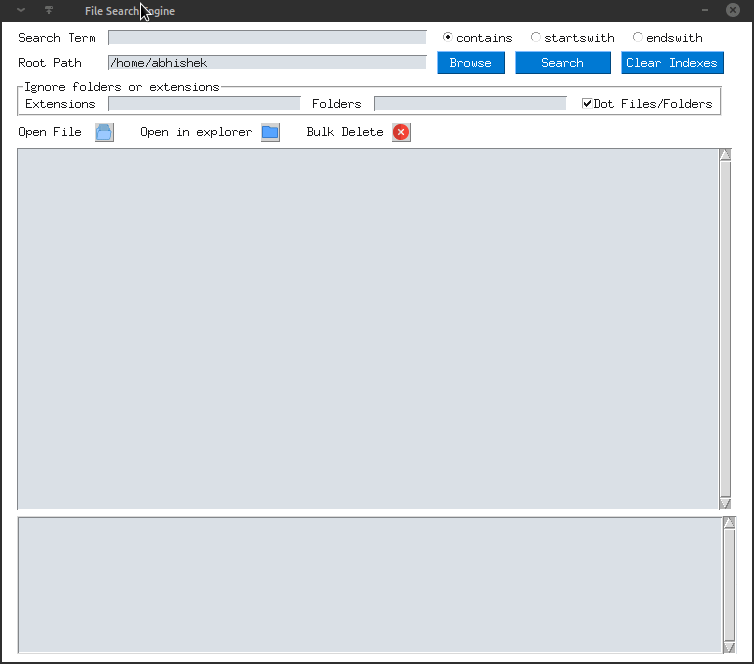

# File search GUI Application

Build using PySimpleGUI
- Search for files.
- Show all the files in the root path.
- Ignore extensions and/or folders.
- Include or ignore dot files and folders.
- Open/Delete a single file or bulk delete files.
- Open the folder of the file in explorer.
- Send a notification on search complete.

